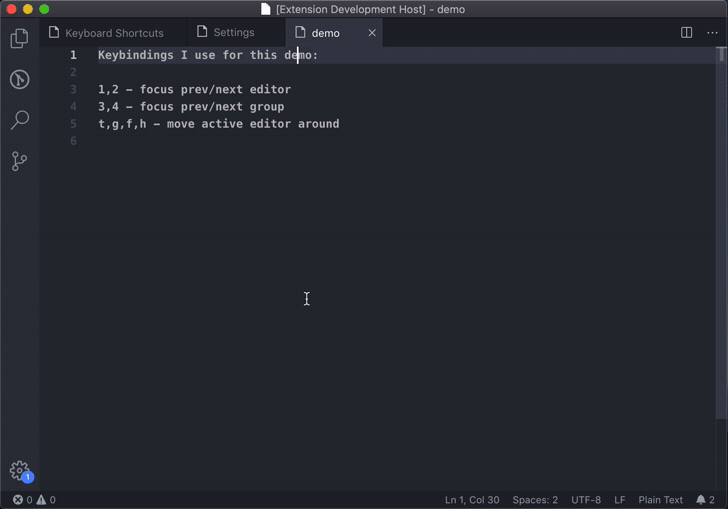

## Keybinding Mode
Keybinding Mode is a vs code extension allowing you to bind commands simply to each letter on your keyboard. Gain 48 easy accessible keybinding slots instead of complicated keybind combos.

## Usage
By double pressing ``` (you can configure your own shortcut) the editor will be switched to a special mode in which all key presses are captured. In the extension settings you can bind commands to letter, allowing a command to be executed in fast and easy way. Double pressing ``` again will disable special mode. The toast notification will be displayed every time the mode is switched.

## Demo
In the demo below I bound tabs related functionalities, like focusing editors and screen spliting, using following config:


```
Keybindings I use for this demo:
1,2 - focus prev/next editor
3,4 - focus prev/next group
t,g,f,h - move active editor around

Extension config:
1,workbench.action.previousEditorInGroup
2,workbench.action.nextEditorInGroup
3,workbench.action.focusPreviousGroup
4,workbench.action.focusNextGroup

t,workbench.action.moveEditorToAboveGroup
g,workbench.action.moveEditorToBelowGroup
h,workbench.action.moveEditorToRightGroup
f,workbench.action.moveEditorToLeftGroup
```

## Motivation
I extensively use tabs while I'm developing and so far I couldn't find easy (and not yet occupied) keybinding slots for all the shortcuts I want to use.


## Limitations
Due to limitations in how vs code keybindings logic is made (not respecting `when` clause in single letter rules), command binding has to be done from the extension settings view.